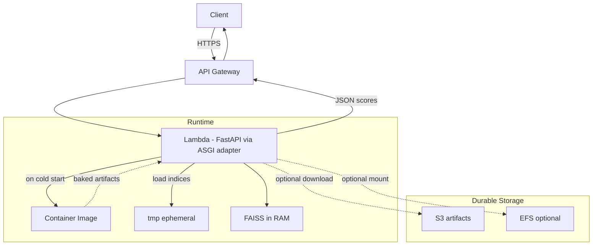
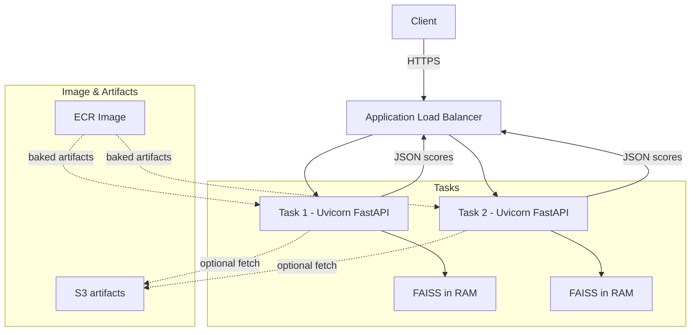
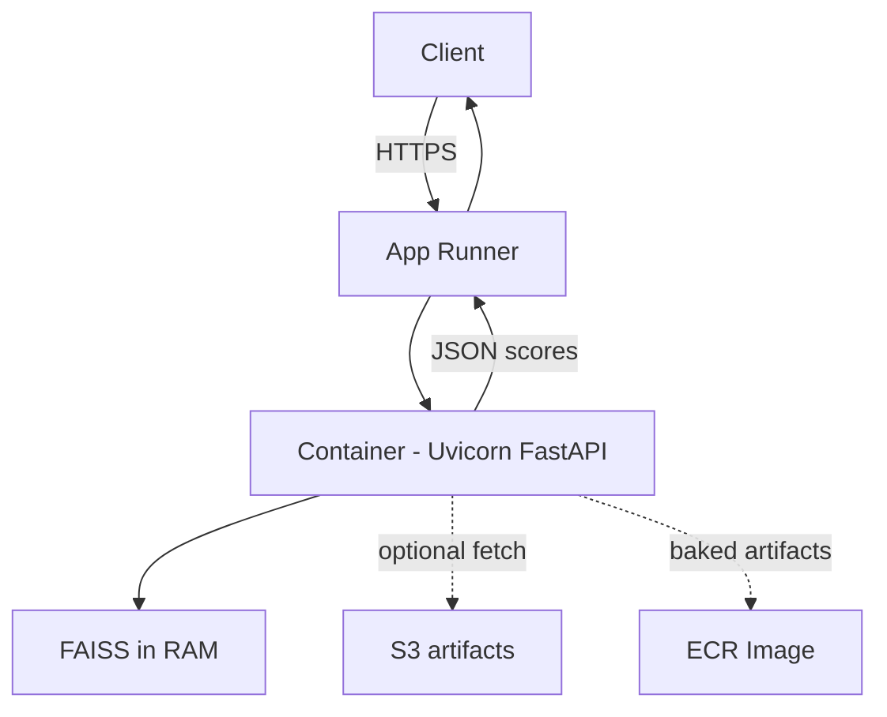

# LeadGen Embeddings (Day 1)

Minimal prototype for lead scoring using text + tabular embeddings and FAISS.

## Quickstart

```bash
make data
make indices
make api
# In another shell
curl -X POST localhost:8000/score_lead -H "Content-Type: application/json" -d '{
  "customer_id": 0,
  "name": "Jane Doe",
  "industry": "Finance",
  "company_size": 500,
  "country": "US",
  "job_title": "Portfolio Manager",
  "bio": "Works on trading strategies and allocator relationships.",
  "web_activity_score": 0.8,
  "email_engagement_score": 0.7
}'
```

## Architecture (ASCII)

```
        +----------------+        +---------------------+        +------------------+
        |  CRM Parquet   |        |  Preprocess & Feat  |        |  Embeddings      |
        |  (data/*.pq)   |  -->   |  - text blob        |  -->   |  - text (E5)     |
        +----------------+        |  - freq encoders    |        |  - tabular (PCA) |
                                   +---------------------+        +------------------+
                                                |                           |
                                                v                           v
                                          +-----------+              +-------------+
                                          |  Concate  |  ----->      |  L2 Norm    |
                                          +-----------+              +-------------+
                                                  |                          |
                                                  v                          v
                                        +-------------------+     +-------------------+
                                        | FAISS Index (all) |     | FAISS Index (high)|
                                        +-------------------+     +-------------------+
                                                     |                     |
                                                     v                     v
                                              +-------------------------------+
                                              | FastAPI: POST /score_lead     |
                                              | Returns: S_look, S_novel,     |
                                              | contrast, neighbor ids        |
                                              +-------------------------------+
```

## Why FAISS by default?

- Simple, fast ANN with cosine via inner product on normalized vectors.
- No infra dependency for Day-1. pgvector is optional (see `infra/docker-compose.yml`).

## Notes

- k=20 hardcoded for Day-1; thresholds TBD in Day-2 notebooks.
- Explanations are placeholders (nearest neighbor ids); richer explanations to come.

## Deployment on AWS

### Artifacts and image

- Bake artifacts into the image for fastest startup (recommended):
  - During Docker build, run:

    ```bash
    make data && PYTHONPATH=. make indices
    ```

  - This produces `artifacts/` (FAISS indices, scaler/PCA, feature_meta, emails) inside the image.
- Offline mode works (no Hugging Face). The text embedder falls back to a hashing vectorizer.
- Container listens on port 8000 with health at `/health`.

### Option A: App Runner (simplest managed)

- Push the image to ECR.
- Create App Runner service from ECR image:
  - Port: 8000
  - Health check path: `/health`
  - CPU/memory: start with 1 vCPU / 2 GB
  - Auto scaling: min 1, max per traffic
- Pros: zero infra to manage, TLS/URL out of the box. Cons: fewer networking knobs than ECS.

### Option B: ECS Fargate (more control)

- Push image to ECR. Create ECS cluster and service (Fargate):
  - Task definition: container port 8000
  - Service: attach an ALB, target group health path `/health`
  - CPU/memory: e.g., 0.5–1 vCPU / 1–2 GB
  - Desired count: >=1; add autoscaling policies as needed
- Pros: VPC control, scaling policies, enterprise fit. Cons: more setup than App Runner.

### Option C: Lambda (serverless, cold-start tradeoffs)

- Package as a container image; add a lightweight adapter (e.g., `mangum`) to run FastAPI on Lambda/ALB or API Gateway.
- Provisioned concurrency recommended to reduce cold starts (FAISS/model load time). Memory 2048–4096 MB is typical.
- Pros: pay-per-use, zero servers. Cons: cold starts, request/response size/time limits.

### Build and push (ECR)

```bash
AWS_ACCOUNT=123456789012
AWS_REGION=eu-west-1
REPO=leadgen-embeddings

aws ecr create-repository --repository-name $REPO || true
aws ecr get-login-password --region $AWS_REGION | docker login --username AWS --password-stdin $AWS_ACCOUNT.dkr.ecr.$AWS_REGION.amazonaws.com

docker build -t $REPO .
docker tag $REPO:latest $AWS_ACCOUNT.dkr.ecr.$AWS_REGION.amazonaws.com/$REPO:latest
docker push $AWS_ACCOUNT.dkr.ecr.$AWS_REGION.amazonaws.com/$REPO:latest
```

### Runtime configuration

- No required env vars for offline mode.
- If using a local SentenceTransformer model, point `TEXT_MODEL_NAME_PRIMARY` in `leadgen/config.py` to a local path baked in the image.
- Health: `GET /health`
- Scoring: `POST /score_lead`

### Choosing a platform

- App Runner: choose for fastest path to a managed HTTPS API.
- ECS Fargate: choose for VPC integration and fine-grained scaling.
- Lambda: choose for bursty workloads with provisioned concurrency to tame cold starts.

### Lambda deployment guide (step-by-step)

1) Build artifacts from S3

- Ensure local AWS creds (AWS_PROFILE/keys) and `s3fs` installed (already in requirements).
- Point to your parquet on S3 (or a view/export that is filtered to current rows if you use SCD2):

```bash
PYTHONPATH=. python scripts/build_indices.py \
  --input-path s3://your-bucket/path/dim_client.parquet \
  --text-cols first_name,last_name,job_title,bio \
  --cat-cols industry,country \
  --num-cols company_size,web_activity_score,email_engagement_score
# Output is written to artifacts/
```

Notes:

- For SCD Type 2, build from rows where is_current=true (recommended). Create an Athena/ETL export that materializes a parquet of current rows, then reference that S3 path above.

2) Package the Lambda (zip-based)

```bash
rm -rf build && mkdir -p build
pip install -r requirements.txt -t build
cp -R leadgen build/
cp -R artifacts build/
cp -R leadgen/service/lambda_handler.py build/leadgen/service/
cd build && zip -r ../leadgen-embeddings-lambda.zip . && cd -
```

Key settings for the function:

- Handler: `leadgen.service.lambda_handler.handler`
- Runtime: Python 3.11 (arm64)
- Memory: ≥ 2048 MB (3072 MB recommended)
- Timeout: ~30s
- Ephemeral storage: ≥ 1024 MB (2048 MB recommended)
- Provisioned Concurrency: ≥ 1 to reduce cold starts

3) Create the Lambda and upload the zip

- Console or IaC: create the function with the above settings and upload `leadgen-embeddings-lambda.zip`.
- If you prefer a container image, bake code+artifacts into an image and use that instead.

4) Wire API Gateway (or invoke from pipelines)

- HTTP API with ANY `/{proxy+}` to the Lambda (Mangum routes FastAPI correctly).
- Test:
  - GET `/health` → {"status":"ok"}
  - POST `/score_lead` with a JSON body

5) IAM and access

- If artifacts are baked into the package/image: no S3 read needed at runtime.
- If you want to load artifacts from S3 on cold start (not required here), grant S3 read and add your fetch logic.

6) Operations: refresh cadence and dedup

- Rebuild artifacts on a schedule (EventBridge → CodeBuild) to reflect new/current records.
- If using SCD2, build from `is_current=true` snapshot (as in step 1).
- Email duplicate short-circuit is built-in and works immediately between rebuilds.
- Optional: maintain a small online set (email or normalized name+company) in DynamoDB/S3 to block duplicates instantly.

7) Security

- Restrict API with auth (IAM/authorizer) or private VPC integration if required.

## Deployment diagrams (Mermaid)

### Lambda (API Gateway + Lambda + optional EFS)



Notes:

- Indices live in memory per warm instance; use Provisioned Concurrency to reduce cold starts.
- Bake artifacts into image or fetch to /tmp; EFS can be mounted for large models.

### ECS Fargate (ALB + ECS Service)



Notes:

- Scale tasks horizontally; each task holds its own in-memory FAISS.
- Prefer baking artifacts to image for fast container start.

### App Runner (managed HTTPS)



## S3 ingestion and configurable columns

- The index build script can read from local or S3 and lets you choose columns used for text/categorical/numeric features.
- Install s3fs (already in requirements) and ensure your AWS credentials are available to pandas (env vars or instance role).

Examples:

```bash
# Local parquet (default)
PYTHONPATH=. python scripts/build_indices.py \
  --input-path data/crm.parquet \
  --text-cols job_title,bio \
  --cat-cols industry,country \
  --num-cols company_size,web_activity_score,email_engagement_score

# S3 parquet
PYTHONPATH=. python scripts/build_indices.py \
  --input-path s3://my-bucket/path/to/dim_client.parquet \
  --text-cols first_name,last_name,job_title,bio \
  --cat-cols industry,country \
  --num-cols company_size,web_activity_score,email_engagement_score

# Using env vars instead of flags
export LEADGEN_INPUT_PATH=s3://my-bucket/path/to/dim_client.parquet
export LEADGEN_TEXT_COLS=first_name,last_name,job_title,bio
export LEADGEN_CAT_COLS=industry,country
export LEADGEN_NUM_COLS=company_size,web_activity_score,email_engagement_score
PYTHONPATH=. python scripts/build_indices.py
```

Notes:

- Only columns you provide are used; missing columns are zero-filled.
- Emails are read if present in the dataset and used for duplicate short-circuiting (exact match) at API time.
- If you want to use name/company/address as text, include them in `--text-cols`; they’ll be concatenated.
